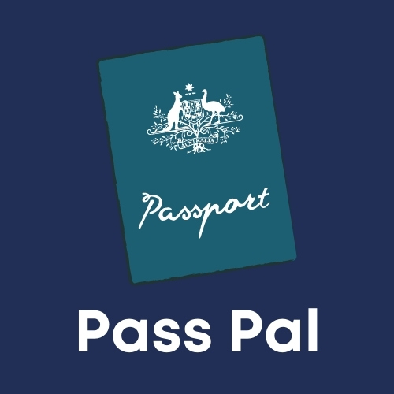

# 2020 Bootcamp Team 8 - `<PassPAL>`

## Team Members

| Role               | Name               | Contact            |
|--------------------|--------------------|--------------------|
| Backend Developper, Frontend Developper, DB Manager | Tunahan Öcal| [![LinkedIn][linkedin-shield-to]][linkedin-url-to]|
| Frontend Developper | Mahmut Furkan Kara | [![LinkedIn][linkedin-shield-mfk]][linkedin-url-mfk]|
| Backend Developper, Frontend Developper | Miray Suzan Şenyüz | [![LinkedIn][linkedin-shield-mss]][linkedin-url-mss]|
| Frontend Developper | Ezgi İmamoğlu      | [![LinkedIn][linkedin-shield-ei]][linkedin-url-ei]|
| Frontend Developper | Poyraz Özmen       | [![LinkedIn][linkedin-shield-po]][linkedin-url-po]|

<br />
<p align="center">
    
  

  <h2 align="center">PassPal</h2>

  <p align="center">
    Have you ever wondered about passports?Take a look at it!
    
   <p align="center">
    <a href="https://passportapp.azurewebsites.net" target="_blank">Checkout PassPal</a>
  
<!-- TABLE OF CONTENTS -->
  
## Table of Contents

* [About the Project](#about-the-project)
  * [Built With](#built-with)
* [Getting Started](#getting-started)
  * [Prerequisites](#prerequisites)
  * [Installation](#installation)
* [Usage](#usage)
  * [Explore Page](#explore-page)
  * [Compare Page](#compare-page)
  * [Rank Page](#rank-page)
* [Acknowledgements](#acknowledgements)

## About The Project

  This project, named **PassPal**, is used to see the power and rank of mobility score of each country's passport. The mobility score is defined as the number of countries a citizen can enter without a visa. Users can see passports divided between countries, passports of the world ranked by their total mobility score and comparing different passports.

Here's why you want to use this website:
* *Wanna travel but don't know if a visa is required for the country*
* *Wanna find more about passports*
* *or just Curious about passports*

**This project is a shortcut for all**

### Built With 
This section includes the tools and frameworks that we have used

* [ReactJS](https://reactjs.org/)
* [Redux-Saga](https://redux-saga.js.org/)
* [Java SE](https://www.oracle.com/java/technologies/)
* [MySQL](https://www.mysql.com/)
* [Python](https://www.python.org/)
* [Eclipse IDE](https://www.eclipse.org/eclipseide/)
* [Visual Studio Code](https://code.visualstudio.com/)
* [Bootstrap](https://getbootstrap.com)
* [Material UI](https://material-ui.com/)


## Getting Started

Let's set up PassPal locally

### Prerequisites
*Make sure that you have* 
* Node.js and npm
* Java 11
* MySQL

### Installation

1. Clone the repo
```sh
git clone https://github.com/eteration-bootcamp/2020-bootcamp-team-8.git
```
2. Install NPM packages
```sh
npm install
```
3. Run the project
```sh
npm start
```
## Usage

### Explore Page

<p align="center">
    

Here, you see the individual passports all around the world categorized by continents.
When you click any passport you see the some numbers at the bottom of the page.

`Visa-Free` means the person that have selected passport can go that countries without Visa

`Visa On Arrival` means the person that have selected passport should take the Visa on arrival(after landing). 

`Visa Required` means the person that have selected passport should take the Visa before travel. 

### Compare Page

<p align="center">
    

This page is quite interesting.Here you can compare the passports according to visa requirement type . Also you can see the details of numbers that you've seen on the explore page.You can compare up to 4 passports.

`Just select a passpaort then you will get what is going to be happen`

### Rank Page

<p align="center">
    

Here you will see How strong your pass is ! 

## Acknowledgements

We would like to thank `Eteration` for giving us a chance at this bootcamp, `all our teachers` for training us and our `mentor` who helped us, `HR Team` for notifying us everyday.:heart: 

[linkedin-url-mfk]: https://www.linkedin.com/in/mahmut-furkan-kara-9b41261a2
[linkedin-shield-mfk]: https://img.shields.io/badge/%20-Mahmut%20Furkan%20Kara-black.svg?style=plastic&logo=linkedin&color=important
[linkedin-url-mss]:https://www.linkedin.com/in/miray-senyuz-1459141a0/
[linkedin-shield-mss]:https://img.shields.io/badge/%20-Miray%20Suzan%20%C5%9Eeny%C3%BCz-black.svg?style=plastic&logo=linkedin&color=brightgreen
[linkedin-url-to]:https://www.linkedin.com/in/tunahanocal/
[linkedin-shield-to]:https://img.shields.io/badge/%20-Tunahan%20%C3%96cal-black.svg?style=plastic&logo=linkedin&color=blue
[linkedin-url-ei]:https://www.linkedin.com/in/ezgi-imamo%C4%9Flu-17295815b/
[linkedin-shield-ei]:https://img.shields.io/badge/%20-Ezgi%20%C4%B0mamo%C4%9Flu-black.svg?style=plastic&logo=linkedin&color=blueviolet
[linkedin-url-po]:https://www.linkedin.com/in/poyraz-ozmen/
[linkedin-shield-po]:https://img.shields.io/badge/%20-Poyraz%20%C3%96zmen-black.svg?style=plastic&logo=linkedin&color=yellow
